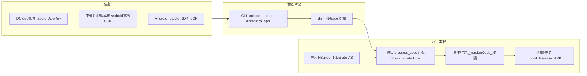

# uni-app 项目离线打包 Android APK

## 现状与阻塞项

- 工程为 **uni-app Vue3 + Vite**，依赖已含 `@dcloudio/uni-app-plus`（具备打 App 端条件）。
- `[mobile-app/package.json](h:\360\360se6\bubulove12\bubulove12\mobile-app\package.json)` **没有** `app-android` / `app` 构建脚本，执行阶段可补充一行脚本便于重复构建（例如 `uni build -p app-android`，以实际 CLI 支持的 `-p` 为准）。
- `[mobile-app/src/manifest.json](h:\360\360se6\bubulove12\bubulove12\mobile-app\src\manifest.json)` 顶层 `**"appid": ""` 为空**：离线打包要求 `assets/apps` 下目录名、`dcloud_control.xml` 中的 appid 与 manifest 一致，且云/离线控制台都依赖该 id。**必须先**在 [DCloud 开发者中心](https://dev.dcloud.net.cn/) 创建应用并填入 `appid`。
- 离线文档还要求在原生工程中配置 `**dcloud_appkey`**（`AndroidManifest.xml` 的 `meta-data`），需在开发者中心申请 **AppKey** 并替换占位符。

## 总体流程（你选择的：离线 SDK）

## 实施步骤

### 1. DCloud 与 manifest 对齐

- 注册/登录 DCloud，创建应用，取得 `**appid**`，在开发者中心申请 **Android 离线打包用的 AppKey**（用于原生 `dcloud_appkey`）。
- 将 `appid` 写入 `[mobile-app/src/manifest.json](h:\360\360se6\bubulove12\bubulove12\mobile-app\src\manifest.json)`；确认 `versionName` / `versionCode` 与后续 Gradle 中 `versionName` / `versionCode`、`applicationId`（包名）规划一致。
- **版本匹配**：当前依赖锁在 `@dcloudio/*` 的 `3.0.0-5000620260331001`。下载离线 Android SDK 时，选择与该 **uni 运行时** 对应的 SDK 包（SDK 压缩包内 `Readme.txt` 会说明与 HBuilderX/基础库版本关系），避免 JS 与原生壳不一致导致白屏或崩溃。

### 2. 本机构建 App 端资源

- 在 `mobile-app` 目录安装依赖后执行 App 端构建（执行阶段会确认官方 CLI 平台名是 `app-android` 还是 `app`，因不同文档写法略有差异）。
- 构建成功后，在 `dist/build/` 下会出现可拷贝到原生工程的 **apps 资源**（含以 `appid` 命名的目录）。若文档要求从 HBuilderX「发行 → 原生 App → 生成本地打包 App 资源」导出，可与 CLI 产物二选一，以 **与当前工程构建方式一致** 为准（CLI 项目优先用 CLI 产物）。

### 3. Android 离线 SDK 与工程

- 从官方说明页下载 **Android 离线 SDK**：[App 离线 SDK 下载](https://nativesupport.dcloud.net.cn/AppDocs/download/android.html)（目录结构含 `HBuilder-Integrate-AS`、`SDK` 等，见 [Android 离线打包开发环境](https://nativesupport.dcloud.net.cn/AppDocs/usesdk/android.html)）。
- 用 Android Studio **导入** `HBuilder-Integrate-AS`（文档推荐 2.7.0 后的集成工程）；按文档将 `SDK` 中 `libs` 的 **aar/jar**、`assets/data` 等放到对应位置。
- 注意文档对 **Gradle / compileSdk** 的最低要求（例如较新说明提到 HBuilderX 4.81+ 与 compileSdk 36、Gradle 8.14.x 等）；以你所下载 SDK 包内示例工程与 `Readme` 为准，避免版本混用。

### 4. 接入 uni-app 资源与配置

- 将 CLI 生成的应用资源放入原生工程的 `**assets/apps/<你的appid>/`**（与官方截图/说明一致），并编辑 `**dcloud_control.xml`**：其中 **appid** 必须与 manifest 及文件夹名一致。
- 在 `AndroidManifest.xml` 的 `Application` 下配置 `**dcloud_appkey`** 为步骤 1 申请的 AppKey。
- 在模块 `build.gradle` 中设置 `**applicationId`**（包名）、`**versionCode` / `versionName`**，与 `[manifest.json](h:\360\360se6\bubulove12\bubulove12\mobile-app\src\manifest.json)` 保持一致；权限列表与 manifest 中 `app-plus.distribute.android.permissions` 等业务需求对齐（当前已有一批相机/网络等权限声明）。

### 5. 签名与出包

- 使用 `keytool` 生成 keystore（可参考技能内示例：[keystore.md](C:\Users\lenovo.cursor\skills\uniapp-native-app\examples\android\keystore.md)），在 app 模块 `build.gradle` 配置 `signingConfigs`，对 **release** 构建签名。
- Android Studio：**Build → Generate Signed Bundle / APK** 或命令行 Gradle 打 **release APK**，安装到真机验证启动与核心页面。

### 6. 仓库内可选小改动（执行阶段）

- 在 `[mobile-app/package.json](h:\360\360se6\bubulove12\bubulove12\mobile-app\package.json)` 增加脚本，例如 `"build:app-android": "uni build -p app-android"`（最终以 CLI 实测可用平台名为准），便于团队一键出资源。

## 风险与注意点

- `**appid` / AppKey / SDK 版本** 任一对不齐都会导致运行期异常；优先以 DCloud 控制台与 SDK `Readme` 为准。
- 离线文档明确 **App 离线 SDK 不支持 Kotlin** 为主工程语言；请沿用官方示例的 Java/Gradle 结构。
- 若后续集成 **uts 插件** 或上架 Google Play 对 **install-apk** 等库有特殊要求，需按 [官方 FAQ](https://nativesupport.dcloud.net.cn/AppDocs/FAQ/android.html) 调整依赖。

## 参考链接

- [App 离线打包总文档](https://nativesupport.dcloud.net.cn/AppDocs/)
- [Android 离线 SDK 集成说明（含 assets、Manifest、Gradle）](https://nativesupport.dcloud.net.cn/AppDocs/usesdk/android.html)

