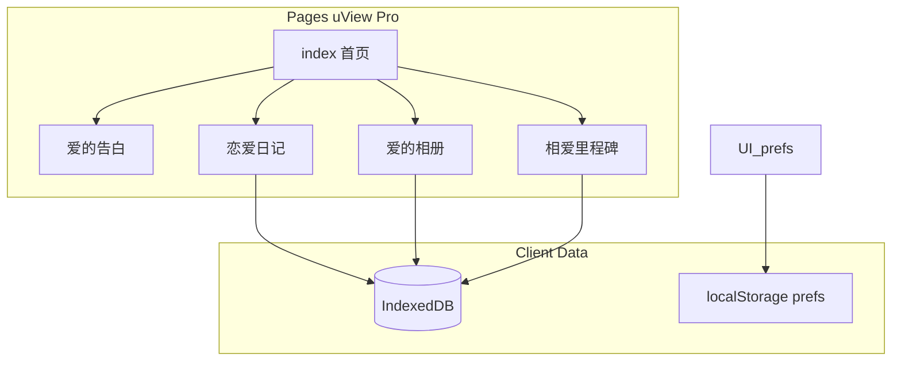

# uni-app + uView Pro 实现《布布与一二的恋爱日记》

## 现状与约束

- 仓库几乎无应用代码：仅有 [docs/移动端WEBAPP需求文档.md](docs/移动端WEBAPP需求文档.md)、[example/ui.html](example/ui.html)（约 2770 行，含 Tailwind 设计 token、首页/多模块结构）。
- **Stitch MCP**（`user-stitch`）当前 [STATUS 为 errored](C:\Users\lenovo.cursor\projects\h-360-360se6-bubulove12-bubulove12\mcps\user-stitch\STATUS.md)。实施前需在 Cursor 设置中恢复 Stitch MCP（见 [Stitch MCP 指南](https://stitch.withgoogle.com/docs/mcp/guide/)）。恢复后：`projectId=3890258888620866149`（来自设计稿 URL），用 **list_screens** 枚举屏幕，再对每屏 **get_screen**，HTML 用 skill 中的 `fetch-stitch.sh` 拉取（GCS URL 更稳）。
- 设计稿 URL 无 `node-id` 参数，**screenId 必须通过 list_screens 获取**，不能仅从 URL 解析。
- 技术栈约束：遵循 [contract.md](C:\Users\lenovo.cursor\skills\stitch-uviewpro-components\references\contract.md) —— 交互控件优先 **u-***（`u-navbar`、`u-tabs`、`u-card`、`u-form`/`u-input`、`u-picker`、`u-radio`、`u-upload`、`u-modal`/`u-popup`、`u-empty` 等），Vue 3 插槽用 `#label` / `#suffix` / `#right`，禁止自定义 tab 条替代 `u-tabs`、禁止 Picker 的 `:columns` 等（详见 contract）。

## 目标平台与构建

- 需求文档明确 **浏览器端**、本地存储；默认 **uni-app 编译目标为 H5**（可顺带配置 **PWA**：`manifest` + Service Worker 缓存静态资源，满足「核心列表离线可查看」的验收方向）。
- 若未来需小程序，需单独评估 `IndexedDB`/录音等 API 差异；本计划按 **H5 完整功能** 落地。

## 架构总览

## 1. 工程脚手架与 uView Pro

- 使用官方/uni 脚手架创建 **Vue 3** 项目（Vite 版 uni-app 与团队习惯一致即可；可参考本机 [uniapp-project-creator](C:\Users\lenovo.agents\skills\uniapp-project-creator\SKILL.md) 的一键流程）。
- 安装并配置 **uview-pro**：`main.js` 引入、`pages.json` easycom、`uni.scss` 主题变量；主色与 [example/ui.html](example/ui.html) 中 `primary` / `background` 等对齐（例如主色约 `#bc004f`、背景 `#fef8f4`），在 `uni.scss` 或 uView theme 中统一，避免页面内散落的 magic color。
- 全局：viewport、**safe-area**（`padding-bottom: env(safe-area-inset-bottom)` 等）、触控反馈（`u-button` + 最小热区 **≥88rpx** 对应约 44px）、必要时 `touch-action: manipulation`（可在 `App.vue` 或全局样式）。

## 2. 路由与页面清单（对应需求 §3）

| 模块    | 建议路径                                                                   | 核心 UI（uView）                                                                                                                                                      |
| ----- | ---------------------------------------------------------------------- | ----------------------------------------------------------------------------------------------------------------------------------------------------------------- |
| 首页    | `pages/index/index`                                                    | 全屏 slogan + **2×2** `u-button`（或 `u-grid` + button），`u-navbar` 标题区                                                                                                |
| 爱的告白  | `pages/confession/index`                                               | `u-card` / 排版用 `u-text`，长文可读、无横向溢出                                                                                                                                |
| 恋爱日记  | `pages/diary/list`、`pages/diary/edit`、`pages/diary/detail`             | `u-search`；日期筛选 `u-datetime-picker` 或 `u-calendar`；表单 `u-form`/`u-input`/`u-textarea`；隐私 `u-radio-group`；图片 `u-upload` + 预览；语音录制 `uni.getRecorderManager` + 播放 UI |
| 爱的相册  | `pages/album/list`、`pages/album/detail`（及相册编辑若设计有）                     | `u-upload`；相册列表 `u-grid`/`u-waterfall`；排序：H5 可用 **movable-view** 或轻量拖拽方案；封面/收藏 `u-action-sheet`/`u-modal`                                                         |
| 相爱里程碑 | `pages/milestone/list`、`pages/milestone/edit`、`pages/milestone/detail` | 时间线列表 `u-list` 或自定义 + `u-line`；日期与农历/公历切换 `u-radio` + `u-picker`；「重要时刻」开关 `u-switch`；首页提醒栏数据读 `milestones` 中「重要」且日期临近项                                            |

在 [pages.json](pages.json) 注册上述页面，**首页为 index**；子页用 `u-navbar :autoBack="true"`。

## 3. 数据层（需求 §4.2）

- 新建 `utils/db`（或 `composables/useIndexedDb`）：封装 **IndexedDB**，Object Store：`diaries`、`albums`、`photos`、`milestones`（字段与文档示例一致：标题、内容、媒体引用、时间、隐私、封面引用、排序、是否重要等）。
- 媒体策略：图片优先 **压缩后 blob/base64** 存 object store 或 IndexedDB；语音存 blob + 列表只保留 id 引用；大文件做数量/大小限制与简单提示（`uni.$u.toast`）。
- **localStorage**：主题、最近一次筛选条件、可选「已读」红点状态（若首页需要）。

## 4. 功能实现要点（与验收对齐）

- **首页**：四个入口文案与 PRD 一致（恋爱日记、爱的相册、相爱里程碑、爱的告白）；点击缩放反馈；导航到各模块。
- **日记**：列表下拉刷新（`onPullDownRefresh`）；新建/编辑校验；多图上传与预览（`uni.previewImage`）；列表/详情语音播放；关键词搜索 + 年月日筛选。
- **相册**：多选上传；相册 CRUD；拖拽排序（实现时优先 H5 可行方案）；设置/取消封面；收藏列表；分享：`navigator.share` 可用则用，否则复制链接或 `uni.share` 文档说明（H5 以 Web Share + 兜底为主）。
- **里程碑**：时间线倒序；编辑页农历/公历（可先 **公历 + 农历显示** 或接入小型农历库，按工期取舍）；「提前 N 天提醒」可用 `localStorage` 记下次检查时间 + 首页展示条（完整系统通知属 v2，文档 §5.1 已标为可选）。
- **隐私与说明**：关于页或弹窗中说明「数据仅存储在本机浏览器」（需求 §4.4）。

## 5. Stitch 设计落地流程（执行阶段）

1. 修复 Stitch MCP → **list_screens(projectId)** → 为每个 screenId **get_screen**。
2. 下载 `htmlCode.downloadUrl`（bash 脚本）、对照 **screenshot** 核对布局。
3. 按 [stitch-html-patterns.md](C:\Users\lenovo.cursor\skills\stitch-uviewpro-components\references\stitch-html-patterns.md)、[tailwind-to-uviewpro.md](C:\Users\lenovo.cursor\skills\stitch-uviewpro-components\references\tailwind-to-uviewpro.md) 将结构转为 **rpx + u-***；禁止把 Tailwind class 原样堆进页面。
4. MCP 不可用时：以 [example/ui.html](example/ui.html) 的区块与色板为单一事实来源，保证视觉与信息架构一致。

## 6. 质量与交付

- 自测：375×667～428×926 竖屏；首屏资源与图片懒加载；Lighthouse 抽样（性能/可访问性）向文档 KPI 靠拢。
- 对照 [architecture-checklist.md](C:\Users\lenovo.cursor\skills\stitch-uviewpro-components\resources\architecture-checklist.md) 与 contract 做一轮页面审查。

## 主要风险

| 风险             | 应对                                             |
| -------------- | ---------------------------------------------- |
| Stitch MCP 不可用 | 用 `example/ui.html` + 需求文档完成功能；MCP 恢复后再对齐像素级细节 |
| 全量功能工期大        | 按模块并行：先首页+存储骨架，再日记→相册→里程碑→告白；PWA 最后加           |
| 相册拖拽在 H5 兼容性   | 优先 movable-view/自研排序，避免重依赖                     |

