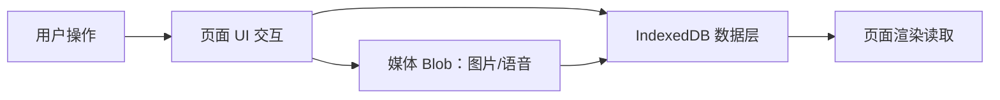

# 《布布与一二的恋爱日记》MVP 开发计划（移动端 WEBAPP / 纯前端版）

日期：2026-03-25  
版本：1.0  
对齐文档：`docs/移动端WEBAPP需求文档.md`（恋爱日记模块 MVP 范围）  
UI 参照：`example/love-diary/*`

---

## 1. 目标与交付

完成 MVP 阶段的移动端 WEBAPP（纯前端，无后端依赖），支撑用户在手机浏览器中完成恋爱记录的核心闭环：

- 首页：重要时刻提醒展示（含未读/重要标识的展示态 + 数据驱动占位）
- 爱的告白：告白表单提交与历史列表浏览（含私密/公开展示态）
- 恋爱日记：列表/搜索筛选/新建/查看/详情展示（图片多选预览、语音播放 UI）
- 基础相册：上传与相册列表浏览（多图上传、基础预览、进入详情）

**MVP 不做：**

- 服务端登录/同步
- 完整的“拖拽排序可落盘重排”逻辑（可作为后续 v1.1/v2.0）
- PWA 离线能力（可做可选增强，但 MVP 默认不作为硬性验收项）

---

## 2. MVP 范围（对齐 PRD）

### 2.1 页面与功能态

1. 首页（`example/love-diary/home.html` 对齐）
   - 展示“重要时刻提醒”卡片（倒计时/重要 badge/未读红点 UI）
   - 从首页进入：爱的告白、恋爱日记列表、基础相册、里程碑（展示入口；里程碑交互在后续阶段完善）
   - MVP 里 milestones 的实现重点仅限：**首页提醒展示所需的数据读写与 UI 呈现**（不实现完整里程碑管理流）

2. 爱的告白（`example/love-diary/confession.html` 对齐）
   - 告白表单：标题（可选）、内容、心动标签（多选 UI态）、私密/公开开关（UI态）
   - 历史告白列表：列表项卡片展示（标题、时间、隐私 badge、预览文本）

3. 恋爱日记列表/筛选/新建/详情（`example/love-diary/diaries-*.html` 对齐）
   - 列表：标题、日期、隐私 badge、预览文本；支持搜索关键词输入 UI
   - 筛选：日期（年/月/日选择器 UI）、私密/公开筛选 UI
   - 新建：标题、日期、内容；图片多选缩略网格 + 预览大图弹层；语音录制/播放条 UI（录制/播放为真实能力或 UI 兜底，见数据层章节）
   - 编辑：以“新建一致布局 + 回显差异”为原则（MVP 先实现新建与详情，编辑可最简化为从详情进入“编辑状态”）
   - 详情：内容排版、图片网格预览弹层、语音播放条展示

4. 基础相册（`example/love-diary/albums-*.html` 对齐）
   - 列表：相册封面、名称、图片数、收藏 badge（如收藏在 MVP 中未落地，可先做展示态）
   - 上传：权限提示态（相册/相机），多图选择上传（可通过浏览器文件选择实现）
   - 详情：图片网格预览；删除按钮态（UI态可先做，不强制实现真实删除）

### 2.2 数据与存储（仅本地浏览器侧）

- 结构化业务数据：IndexedDB（主）
- 轻量配置/偏好：localStorage（例如：主题、最近打开条目、未读标记）
- 媒体存储策略（MVP 方案）：
  - 图片：Blob/文件对象转存为 IndexedDB（或存为 base64/blob，按容量做上限控制）
  - 语音：Blob 存入 IndexedDB，并在列表页/详情页仅保存引用键

---

## 3. 里程碑排期（示例 Day1 - Day19）

> 可按团队实际节奏微调。本计划以可验收为导向拆分工作包。

### Day 1-2：技术准备与通用组件落地

- 路由/页面切换（纯前端）
  - 保持多页面或单入口分区两种方式二选一
  - 统一底部导航与顶部 Header（引用当前 UI 结构与类名思想）
- 通用组件
  - `Card`、`Modal`（图片预览弹层）、`ImageGrid`、`Voice` 播放条（UI + 真实能力接入方式）
- 样式一致性
  - 复用 `example/love-diary/styles.css` 的变量与类命名，避免样式漂移导致验收失败

验收点：

- 页面间跳转工作正常（无断链）
- 触控热区满足最小 44x44px（按钮/图标/可点卡片）

### Day 3-5：数据层实现（IndexedDB 封装）

- IndexedDB 封装
  - stores 建议：`diaries`、`albums`、`photos`、（可选）`confessions`、（可选）`milestones`
  - 提供统一的 CRUD + 查询封装（按日期范围、隐私状态、关键词）
- 媒体存储
  - 图片：选择文件 -> 压缩/缩略图生成（如要做性能优化）-> Blob 入库 -> 列表页按引用键渲染
  - 语音：录制 -> Blob 入库 -> 详情页加载 -> `<audio>` 播放条展示

验收点：

- 基础数据写入/读取可验证（最小闭环：新建日记/相册 => 列表可见 => 详情可读）

### Day 6-12：恋爱日记落地

- 列表页
  - 搜索与筛选（UI 与数据读取联动）
  - 下拉刷新/分页（若无后端接口，则用本地分页）
- 新建页
  - 表单字段落库：标题、日期、内容、隐私状态
  - 图片多选：预览网格（UI）=> 保存 Blob => 回显缩略图
  - 语音录制：UI 录制态 => Blob 入库 => 列表/详情展示播放条
- 详情页
  - 富文本/换行渲染策略（MVP 采用简单段落换行，避免复杂富文本带来的安全/兼容问题）
  - 图片网格：点击进入预览弹层
  - 语音播放：音频加载与时间进度展示

验收点：

- MVP 路径完成：`home -> diaries-list -> diaries-new -> diaries-detail`

### Day 13-16：基础相册落地

- 上传
  - 浏览器权限降级：展示“权限被拒绝”提示 + 提供“仅使用已选择内容”的兜底策略
  - 多图上传：选择多文件 -> 入库 -> 图片网格回显
- 相册列表与封面
  - 封面策略（MVP 最简单：首张图或用户显式选择首图）
- 相册详情
  - 图片网格展示与图片预览弹层
  - 删除按钮态：若不能立刻完成真实删除，可先落 UI 态并把“删除逻辑”作为后续迭代点

验收点：

- MVP 路径完成：`home -> albums-list -> albums-upload(或选择) -> albums-detail -> preview`

### Day 17-19：体验与验收

- 触控目标：关键点击热区 >= 44x44px
- 焦点态：`tab/可见聚焦`高对比可见
- 性能：移动端 Lighthouse 性能 >= 85
  - 图片懒加载、避免过多重排、关键 CSS 减少阻塞
- 可离线（可选）
  - 若做 PWA：保证日记/相册列表至少能离线查看
  - 否则：提供“离线提示 + 本地数据优先渲染”的兜底

验收点：

- 以 PRD 中 KPI 作为最终判定基准

---

## 4. 数据模型与实现要点（建议写入代码约定）

> 该部分用于指导开发实现，不要求一次性完全复杂化。

### 4.1 Diaries（日记）

- `id`：字符串（自增或 UUID）
- `title`：string
- `content`：string（按段落保存）
- `date`：YYYY-MM-DD
- `privacy`：`private|public`
- `photoKeys`：string[]（对应 photos 的键）
- `voiceKey`：string|null
- `createdAt/updatedAt`：时间戳

### 4.2 Albums（相册）

- `id`：string
- `name`：string
- `coverPhotoKey`：string|null（MVP 先用“首图策略”）
- `photoKeys`：string[]
- `tags`：string[]（如 MVP 不落地，可先空数组）
- `createdAt/updatedAt`

### 4.3 Photos（照片）

- `id`：string
- `albumId`：string
- `blob`：Blob（或 base64）
- `thumbnailBlob`：Blob|null（可选）
- `createdAt`

### 4.4 Voice（语音）

- 语音可以复用 photos-style 的独立 store：`voices`
- 或直接把 `voiceBlob` 存在 diaries 的对象中（不推荐，容量风险更大）

---

## 5. 可验收检查表（建议写在文档末尾）

功能类：

- [ ] 首页重要时刻提醒：能读取本地 milestones/标记并渲染
- [ ] 告白：表单 UI -> 本地存储 -> 列表渲染（至少 3 条示例）
- [ ] 日记：列表渲染、搜索/筛选 UI 与数据联动、新建保存、详情可读
- [ ] 日记媒体：图片预览弹层可打开、语音播放条可操作
- [ ] 相册：上传多图（或选择多文件）后列表/详情可见
- [ ] 权限降级：相机/相册权限被拒绝时，页面仍能展示解释与降级策略

体验类：

- [ ] 触控热区 >= 44x44px
- [ ] `:focus-visible` 可见
- [ ] 无横向滚动
 - [ ] Lighthouse 可访问性评分 >= 90（语义化、对比度、焦点可见）

性能/质量类：

- [ ] 移动端 Lighthouse ≥ 85
- [ ] 首屏关键路径可交互时间 TTI ≤ 3s（4G 参考）
 - [ ] 首屏关键 CSS/首要内容优先渲染（降低阻塞与重排）

兼容与测试类：

- [ ] iOS Safari 最近两代、Android Chrome 最近两代（必要时真机/模拟器）验证

安全与隐私类：

- [ ] 隐私说明明确“业务数据仅存储本地浏览器，不上传服务器”
- [ ] 权限被拒绝时有清晰降级提示（并给出“如何去设置开启”的引导文案占位）
- [ ] 如部署线上：全站 HTTPS

---

## 6. MVP 数据流（对齐 Mermaid，写入文档可指导开发）

---

## 7. 与现有 UI 设计稿的衔接

- 通用样式：`[example/love-diary/styles.css](example/love-diary/styles.css)`
- 页面入口（当前已生成 UI 设计稿，用作字段/组件对齐依据）：
  - 首页：`example/love-diary/home.html`
  - 爱的告白：`example/love-diary/confession.html`
  - 恋爱日记：`example/love-diary/diaries-list.html`、`diaries-new.html`、`diaries-edit.html`、`diaries-detail.html`
  - 相册：`example/love-diary/albums-list.html`、`example/love-diary/albums-detail.html`

后续将把 UI 中的“UI态弹层/按钮/控件”逐项绑定到真实数据读取/写入路径。

